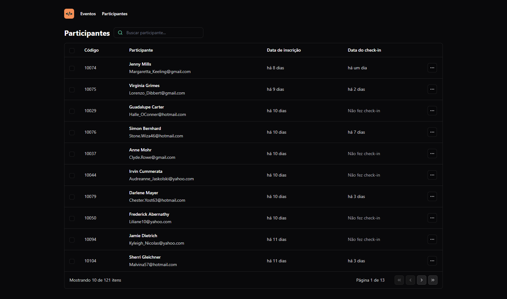

<h1 align="center"> NLW Unite </h1>

Projeto construído na 15º edição do evento Next Level Week da Rocketseat. 🚀🔥

  <a href="#-tecnologias">Tecnologias</a>&nbsp;&nbsp;&nbsp;|&nbsp;&nbsp;&nbsp;
  <a href="#-projeto">Projeto</a>&nbsp;&nbsp;&nbsp;|&nbsp;&nbsp;&nbsp;
  <a href="#-links">Links</a>

 

  

> Trilha React

A trilha React do evento abrange várias tecnologias front-end. Nessa trilha, também há uma conexão com um banco de dados que traz dados fictícios para a tabela.

## 🚀 Tecnologias

Esse projeto foi desenvolvido com as seguintes tecnologias:

- HTML 
- CSS
- Figma
- JavaScript
- Git e Github
- React
- TypeScript
- Tailwind CSS
- Node.js

         

## 💻 Projeto

Este projeto foi criado com o objetivo de desenvolver uma tabela que mostra os dados pessoais de participantes (seja de um evento ou de funcionários de uma empresa, por exemplo).

## 🔗 Links

 